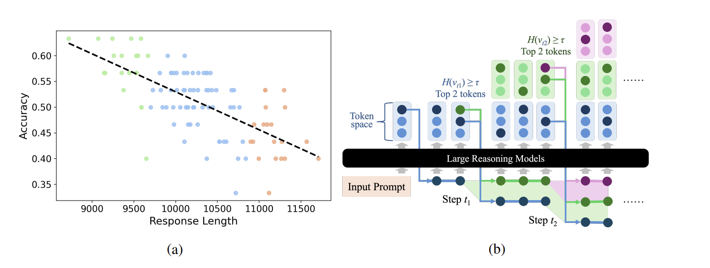

# **Decoding Tree Sketching (DTS)**
[]() []() []() []()
[]()

> **Official Implementation of Paper**
> **[DTS: Enhancing Large Reasoning Models via Decoding Tree Sketching](https://arxiv.org/abs/)**

<p>
  <a href="#-updates" style="text-decoration: none; font-weight: bold;">🎉 Updates</a> •
  <a href="#-about" style="text-decoration: none; font-weight: bold;">💡 About</a> •
  <a href="#-clone-and-use-dts" style="text-decoration: none; font-weight: bold;">🔍 Clone and Use DTS</a> •
  <a href="#-running-experiments" style="text-decoration: none; font-weight: bold;">🧪 Running Experiments</a> •
  <a href="#-how-does-dts-work" style="text-decoration: none; font-weight: bold;">🚀 How does DTS Work</a> •
  <a href="#-citation" style="text-decoration: none; font-weight: bold;">💬 Citation</a>
</p>

## 🎉 Updates
- **[11/03/2025]** 📣 Released DTS on Colab! [](https://colab.research.google.com/github/ZichengXu/Decoding-Tree-Sketching/blob/main/notebooks/example_DeepSeek_R1_Distill_Qwen_1_5B.ipynb)
- **[10/29/2025]** 📣 Released our Paper on arXiv. See [here](https://arxiv.org/abs/).
- **[10/29/2025]** ✨✨Full codebase of DTS released.


## 💡 About

Decision Tree Sketching (DTS) is a **Training-free** method designed to enhance the reasoning capability of Large Reasoning Models (LRMs). On the AIME benchmark, DTS has substantial improvements:

- Increases accuracy by up to **8.0%**
- Reduces repetition frequency by up to **20%**
- Shortens average reasoning length by over **20%**


> **Note:** All experiments were conducted on NVIDIA H200 GPUs. Results may vary slightly depending on your specific hardware configuration.

## 🏃‍♂️🏃🏻‍♂️🏃🏾‍♂️ Run DTS on Colab 
Run DTS on DeepSeek-R1-Distill-Qwen-1.5B with Colab [](https://colab.research.google.com/github/ZichengXu/Decoding-Tree-Sketching/blob/main/notebooks/example_DeepSeek_R1_Distill_Qwen_1_5B.ipynb)


## 🚀 Clone and Use DTS
DTS is a **plug-and-play** module designed for reasoning models on Hugging Face (not compatible with non-reasoning models).
Simply clone this repository to instantly enhance your model’s reasoning capabilities!

#### 1\. Environment Setup

```bash
git clone https://github.com/ZichengXu/Decoding-Tree-Sketching.git
cd Decoding-Tree-Sketching
conda create -n dts python=3.10
conda activate dts
pip install -e .
```

#### 2\. Run Example
This example shows how to load a model and run inference with DTS decoding.

```python
import torch
from transformers import AutoModelForCausalLM, AutoTokenizer
from decoding_tree_sketching.kvbatch_decoder import KVBatchEGDT

examples = [
    "Find the sum of all integer bases $b>9$ for which $17_b$ is a divisor of $97_b.$",
]
reasoning_tail = r" Please reason step by step, and put your final answer within \boxed{}."

# Replace with your model checkpoint if needed
model_name = "deepseek-ai/DeepSeek-R1-Distill-Qwen-1.5B"
# TODO: Replace with your Hugging Face access token
access_token = "YOUR_HF_ACCESS_TOKEN"
# TODO: Set a directory for model/tokenizer cache
cache_dir = "./YOUR_CACHE_DIR"
seed = 0

# Decoding hyperparameters
DECODE_CONFIG = {
    "entropy_threshold": 2.5,
    "branch_top_k": 3,
    "max_active_hyps": 12,
    "max_new_tokens": 4096,
    "temperature": 0.6,
}

def main():
    tokenizer = AutoTokenizer.from_pretrained(
        model_name,
        token=access_token,
        cache_dir=cache_dir,
        trust_remote_code=True
    )
    model = AutoModelForCausalLM.from_pretrained(
        model_name,
        device_map="cuda",
        torch_dtype="auto",
        token=access_token,
        cache_dir=cache_dir,
        trust_remote_code=True
    )

    kvegdt = KVBatchEGDT(model, tokenizer, seed=seed)

    for example in examples:
        full_prompt = example + reasoning_tail
        text = tokenizer.apply_chat_template(
            [{"role": "user", "content": full_prompt}],
            tokenize=False,
            add_generation_prompt=True
        )
        out = kvegdt.generate(
            text,
            entropy_threshold=DECODE_CONFIG["entropy_threshold"],
            branch_top_k=DECODE_CONFIG["branch_top_k"],
            max_active_hyps=DECODE_CONFIG["max_active_hyps"],
            max_new_tokens=DECODE_CONFIG["max_new_tokens"],
            temperature=DECODE_CONFIG["temperature"],
        )
        
        print(f"*** MODEL OUTPUT ***\n{out['text']}")
        # Print generation statistics such as steps, branch events, and sequence length
        print(f"\n*** GENERATION STATS ***\n{out['stats']}")

if __name__ == "__main__":
    main()       
```


<!-- ## 🎯 Paper Results

Through DTS, we successfully achieve substantial improvements in reasoning performance and efficiency over standard inference on two key mathematical reasoning benchmarks. Our framework consistently improves **accuracy** by up to **8.0%**, reduces **average reasoning length** by over **20%** and reduces **repetition frequency** by up to **80%**. These results demonstrate that DTS effectively mitigates overthinking and generates more concise, accurate, and stable reasoning trajectories that balance performance and efficiency without any training involved. The results are presented below:
> **Note:** All experiments were conducted on NVIDIA H200 GPUs. Results may vary slightly depending on your specific hardware configuration. -->

<!-- | Model                             | Method             |        AIME2024       |                        |                     |        AIME2025       |                        |                     |        Average        |                        |                     |
| :-------------------------------- | :----------------- | :-------------------: | :--------------------: | :-----------------: | :-------------------: | :--------------------: | :-----------------: | :-------------------: | :--------------------: | :-----------------: |
|                                   |                    |      **Acc (%)**      |         **Len**        |     **Rep (%)**     |      **Acc (%)**      |         **Len**        |     **Rep (%)**     |      **Acc (%)**      |         **Len**        |     **Rep (%)**     |
| **DeepSeek-R1-Distill-Qwen-7B**   | Standard Inference |         52.67         |          13902         |         6.7         |         36.00         |          15053         |         12.7        |         44.34         |          14478         |         9.7         |
|                                   | DTS            | **60.67**<br>(+8.00%) |  **9865**<br>(-29.03%) | **1.3**<br>(↓80.6%) | **43.33**<br>(+7.33%) | **12440**<br>(-17.35%) | **2.7**<br>(↓78.7%) | **52.00**<br>(+7.66%) | **11153**<br>(-22.96%) | **2.0**<br>(↓79.4%) |
| **DeepSeek-R1-Distill-Qwen-1.5B** | Standard Inference |         26.67         |          16596         |         15.3        |         24.67         |          17809         |         26.7        |         25.67         |          17203         |         21.0        |
|                                   | DTS            | **32.67**<br>(+6.00%) | **12462**<br>(-24.91%) | **4.7**<br>(↓69.3%) | **26.67**<br>(+2.00%) | **13762**<br>(-22.72%) | **6.0**<br>(↓77.5%) | **29.67**<br>(+4.00%) | **13112**<br>(-23.72%) | **5.4**<br>(↓74.3%) | -->

## 🧪 Running Experiments

Our experimental workflow is designed to be configurable and reproducible. 

#### 1\. Reproduce Our Results for DeepSeek-R1-distilled-Qwen-7B/1.5B on AIME Benchmark

To reproduce main results from the paper, use the provided bash scripts in the `scripts/` directory.
These scripts automatically loop through all combinations of `models` ("1.5B", "7B") and `datasets` ("aime24", "aime25") and pass the correct, paper-matched hyperparameters for each run.

```bash
bash scripts/run_all_dts.sh # DTS
bash scripts/run_all_std.sh # baseline
```
The hyperparameters within these scripts are hard-coded to match our paper's settings.

> **Note:** Our experiments were conducted on NVIDIA H200 GPUs. Results may vary slightly depending on your specific hardware configuration.

#### 2\. Configuration File (`configs/config.yaml`)

This file contains all fundamental configuration settings, such as model names, dataset paths, output directories, and default parameters tailored for each dataset. You can edit this file to change the models, datasets, or prompts. 

<!-- to set your own paths and related parameters. -->
<!-- The core logic is in `decoding_tree_sketching/run_experiment.py`, which reads model/dataset configurations from `configs/config.yaml` and accepts hyperparameters from the command line. -->


#### 3\. Running a Experiment (Manual)

You can also call `decoding_tree_sketching/run_experiments.py` directly to run custome experiments or test different hyperparameters.

**Command Template:**

```bash
python decoding_tree_sketching/run_experiments.py [mode] --model_name [model] --dataset_name [dataset] [OPTIONS]
```

**Argument Explanations:**

  * `[mode]`: (Required) `dts` or `standard`.
  * `--model_name`: The model key from `configs/config.yaml` (e.g., `1.5B`).
  * `--dataset_name`: The dataset key from `configs/config.yaml` (e.g., `aime24`).
  * `[OPTIONS]`:
    * `-e`, `--entropy_threshold`: **[DTS only]** The entropy (uncertainty) threshold $\tau$ to trigger branching.
    * `-k`, `--branch_top_k`: **[DTS only]** The number of new branches (top-K tokens) to create when entropy exceeds the threshold.
    * `-a`, `--max_active_hyps`: **[DTS only]** The maximum number of active hypotheses to maintain during decoding.
    * `-m`, `--max_new_tokens`: Maximum tokens that can be generated.
    * `-s`, `--seed`: Initial random seed.
    * `-n`, `--num_trials`: Number of trials for the repeated experiment.
    * `-t`, `--temperature`: Sampling temperature.

**Example (DTS on 7B model for AIME24):**

```bash
decoding_tree_sketching/run_experiment.py dts \
    --model_name "7B" \
    --dataset_name "aime24" \
    -e 2.5 \
    -k 3 \
    -a 12 \
    -m 32768 \
    -t 0.6 \
    -s 0 \
    -n 5
```

#### 4\. Extending to Other Models or Datasets

This codebase is configured to run the AIME24/AIME25 datasets with the DeepSeek-R1-Distill-Qwen models. To add new models or datasets, you will need to modify the following files:

1.  **`configs/config.yaml`**:

      * **Add new models:** Add a new entry under the `models:` section.
      * **Add new datasets:** Add a new entry under the `datasets:` section. You must provide the template for your new model/dataset pair.

2.  **`decoding_tree_sketching/run_experiment.py`**:

      * The evaluation logic (e.g., `extract_answer_qwq`) is specific to the `\boxed{}` format. You will need to update the evaluation loop to use the correct answer extraction logic for your new dataset.


## 🔍 How does DTS Work?

<!-- This project introduces **DTS (Decoding Tree Sketching)**, a **training-free, model-agnostic decoding framework** designed to mitigate **overthinking** in Large Reasoning Models (LRMs). -->

DTS selectively branches at high-uncertainty tokens and applies early stopping to identify the **most information-dense and concise reasoning path** to balance efficiency and correctness. The design of DTS is driven by two critical, empirical findings regarding LRM behavior:

- There is a clear **anti-correlation** between reasoning length and accuracy.

- The variance in generated output is predominantly determined by **high-uncertainty (high-entropy) tokens**.

The figure below illustrates both this anti-correlation (a) and the resulting DTS framework (b), which selectively branches at high-entropy tokens to find the shortest, most accurate path:
<p align="center">
  
</p>


## 💬 Citation

If you find DTS helpful, please cite the paper and star this repo, thanks!

```bibtex
@inproceedings{
  title={},
  author={},
  booktitle={},
  year={}
}
```


